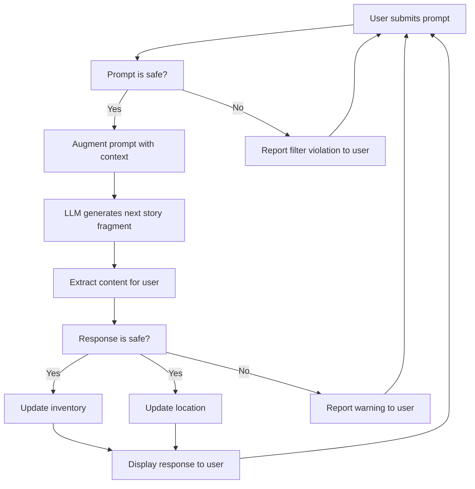

# Workflow diagram

## Details

### Prompt is safe?

Validate the user prompt. Use a chain of classifiers as filters:

- is_off_topic
- is_hate_speech
- is_overtly_sexual
- is_excessively_violent
- involves_self_harm
- violates_rating

### Augment prompt with context

For example,

- system prompt
- game state
- world model
- history
- inventory
- others?

### Response is safe?

- Use the same set of filters as for user input??
    - Maybe some of these are detected by the LLM from the user prompt and reported back in the LLM response?
- Gemini LLM provides some safety ratings in its response. For example,
    - HARM_CATEGORY_HATE_SPEECH
    - HARM_CATEGORY_DANGEROUS_CONTENT
    - See details here:
        - https://ai.google.dev/gemini-api/docs/safety-settings
        - https://ai.google.dev/gemini-api/docs/safety-settings#safety-filters
        - https://ai.google.dev/gemini-api/docs/safety-guidance
