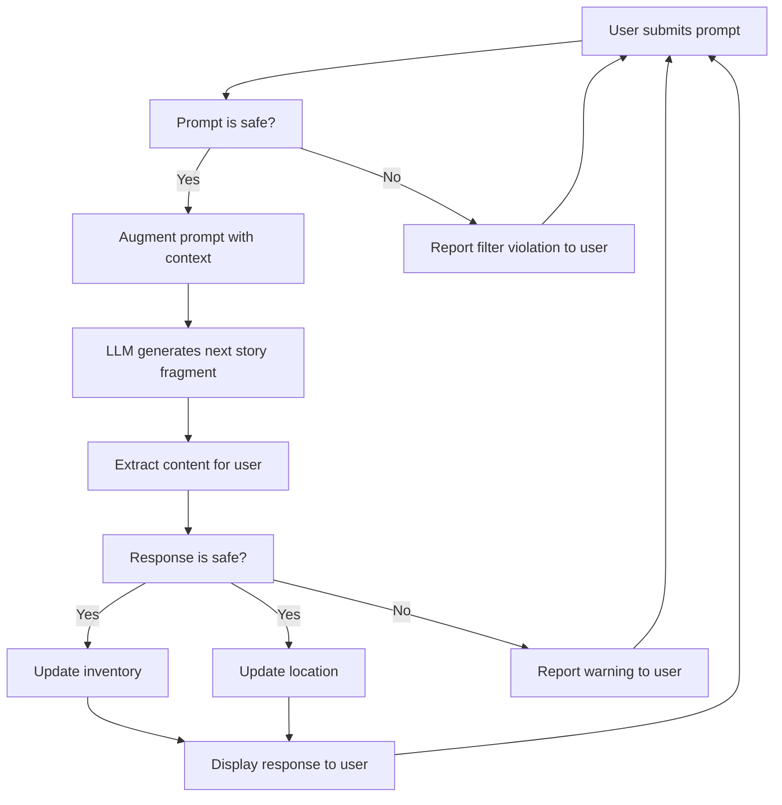

# Workflow diagram

```mermaid
graph TD;
A[User submits prompt] --> B[Prompt is safe?];
B -- Yes --> C[Augment prompt with context];
B -- No --> D[Report filter violation to user];
D --> A
C --> E[LLM generates next story fragment]
E --> F[Extract content for user]
F --> I[Response is safe?]
I -- Yes --> G[Update inventory]
I -- Yes --> H[Update location]
I -- No --> K[Report warning to user]
K --> A
G --> J[Display response to user]
H --> J
J --> A
```
